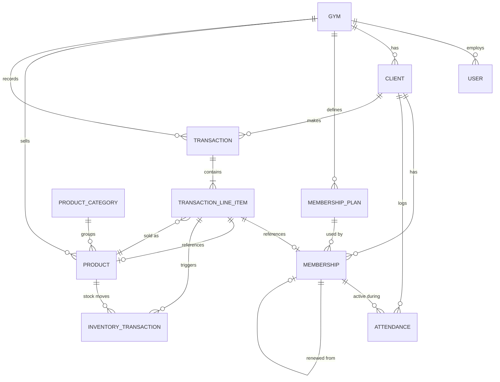

# Domain Model — Gym Management System

This model is designed for MVP (single gym) while keeping a clean migration path to multi-tenant SaaS. The single biggest design decision driving this model: **`gym_id` appears on every table from day one**, even though MVP will only ever have one row in the `Gym` table. See reasoning at the end.

---

## Entity-Relationship Diagram (Mermaid)

---

## Entities

### `Gym` *(tenant root — future-proofing)*

| Field | Type | Notes |
|---|---|---|
| id | UUID/PK | |
| name | string | |
| address | string | |
| contact_info | string | phone/email |
| default_walkin_fee | decimal | |
| expiration_warning_days | int | drives "expiring soon" dashboard flag |
| walkin_inactivity_threshold_days | int | default: 7; drives walk-in "Inactive" status |
| member_inactivity_warning_days | int | default: 14; drives the "At risk" MEMBER client signal — active MEMBER clients who haven't visited within this window are surfaced in the "At risk" filter chip, Dashboard panel, and At-risk Members Report (ADR-019) |
| walkin_conversion_prompt_visits | int | default: 5; walk-in clients who reach this cumulative visit count with no Membership record trigger the pre-fee conversion prompt during check-in (Flow 3/14) and the Attendance Analytics frequent walk-in count — does NOT govern the Dashboard "Frequent walk-ins" top-5 panel (ADR-036) |
| timezone | string | IANA timezone identifier (e.g., "Asia/Manila"); all UTC-stored timestamps are converted to this timezone for display; all "today" date comparisons use the current date in this timezone (ADR-035) |
| created_at / updated_at | timestamp | stored in UTC (ADR-035) |

**Reasoning:** In MVP there is exactly one row in this table. It exists anyway because adding `gym_id` as a foreign key to every other table *now* costs nothing, while adding it after the fact (post-launch, with real data) means rewriting every query and risking cross-tenant data leakage during migration. This is the cheapest insurance in the entire schema.

---

### `User` *(Owner account, future: staff accounts)*

The canonical user record **and** the Better Auth user model (ADR-043, ADR-046). One user table, no parallel auth table. `name`/`email`/`email_verified`/`image` are Better Auth core fields; `username`/`display_username` come from the username plugin (login is by username — US-1.1); `gym_id`/`role` are Better Auth **additional fields** exposed on the session (`{ userId, gymId, role }`).

| Field | Type | Notes |
|---|---|---|
| id | UUID/PK | |
| gym_id | FK → Gym | additional field; multi-tenant scope |
| name | string | Better Auth core field |
| email | string, unique | Better Auth core field (login is by username; email enables future password reset, US-1.6) |
| email_verified | bool | Better Auth core field |
| image | string, nullable | Better Auth core field |
| username | string, unique, nullable | username plugin — the login identifier |
| display_username | string, nullable | username plugin — display form |
| role | enum | additional field. MVP: `OWNER` only. Future: `STAFF`, `MANAGER` |
| created_at / updated_at | timestamp | |

**Credential password hashes are NOT stored here (ADR-046).** They live in the Better-Auth-owned `account` table (`account.password`, `provider_id = "credential"`). There is no `password_hash` column on `User`.

---

### Better Auth–owned tables: `Session`, `Account`, `Verification` *(auth infrastructure)*

Managed by Better Auth (ADR-043, ADR-046). Field names follow Better Auth 1.6's expected schema. These are the **documented exception to `gym_id`-on-every-entity (ADR-001, ADR-025)** — they are framework auth infrastructure, not tenant/domain data; tenancy is carried by the related `User.gym_id`.

- **`Session`** — `id`, `user_id` (FK → User, cascade), `token` (unique), `expires_at`, `ip_address?`, `user_agent?`, `created_at`, `updated_at`.
- **`Account`** — `id`, `user_id` (FK → User, cascade), `account_id`, `provider_id`, OAuth token fields (nullable, unused at MVP), **`password`** (credential hash for username/email + password), `created_at`, `updated_at`.
- **`Verification`** — `id`, `identifier`, `value`, `expires_at`, `created_at`, `updated_at` (reserved; no MVP flow uses it yet).

IDs are DB-generated UUIDs (`advanced.database.generateId = false` + Prisma `@default(uuid(7))`), consistent with the domain UUID PKs.

---

### `Client`

| Field | Type | Notes |
|---|---|---|
| id | UUID/PK | |
| gym_id | FK → Gym | |
| full_name | string, required | |
| contact_number | string, nullable | |
| email | string, nullable | reserved for future notifications |
| notes | text, nullable | freeform owner notes |
| date_registered | date | business "joined" date shown to the owner. Distinct from the system `created_at` insert timestamp (the two coincide at MVP but are kept separate so the displayed join date is a stable business value, not a system artifact). |
| client_type | derived, not stored | `MEMBER` if client has ≥1 non-cancelled Membership record; `WALK_IN` if zero. Cancelled memberships (ADR-041) do not count. Once a non-cancelled membership exists, type never reverts to WALK_IN. |
| status | derived, not stored | branches by client_type — see derivation logic below |
| created_at / updated_at / deleted_at | timestamp | soft delete only |

**Status derivation logic (ADR-017, ADR-037):**
- **`MEMBER` type clients** — derived from membership dates, excluding cancelled memberships (ADR-041) (precedence order: EXPIRING_SOON → ACTIVE → UPCOMING → EXPIRED):
  - `EXPIRING_SOON`: has an active membership (`start_date ≤ today ≤ end_date`) with `end_date` within `Gym.expiration_warning_days` of today
  - `ACTIVE`: has an active membership (`start_date ≤ today ≤ end_date`) where `end_date` is not within the warning window
  - `UPCOMING`: no active membership, but at least one membership where `start_date > today` (ADR-037)
  - `EXPIRED`: no active or upcoming membership; most recent membership has `end_date < today`
- **`WALK_IN` type clients** — derived from attendance recency:
  - `ACTIVE`: `max(Attendance.date)` is within `Gym.walkin_inactivity_threshold_days` of today
  - `INACTIVE`: `max(Attendance.date)` exceeds the threshold, or client has no attendance records at all

**Reasoning:** A stored status flag requires a background sync job and *will* drift. Both `client_type` and `status` are computed at query time from Membership and Attendance records that already exist — zero additional storage, zero sync risk, guaranteed correctness. See ADR-002 and ADR-017.

**At-risk signal (derived, not stored — ADR-019):** A MEMBER client with an in-effect membership (`start_date ≤ today ≤ end_date` — ACTIVE, including Expiring Soon; UPCOMING members are excluded, their period has not begun) and no Attendance record within `Gym.member_inactivity_warning_days` days is considered at-risk. This is a query-time operational signal, NOT a `Client.status` value — an at-risk member's status remains Active or Expiring Soon as determined by their membership dates. At-risk is surfaced in the "At risk" Client List filter chip, the Dashboard "At-risk members" panel, and the At-risk Members Report (US-8.14). A client with an in-effect membership and zero attendance records at all is treated as at-risk immediately (ADR-040).

---

### `MembershipPlan` *(catalog of durations/prices)*

| Field | Type | Notes |
|---|---|---|
| id | UUID/PK | |
| gym_id | FK → Gym | |
| name | string | e.g. "1 Month", "Custom 45-Day" |
| duration_days | int | the month-based plan types map to fixed counts — 1/2/3 months = **30/60/90 days** (ADR-048); "Custom days" stores the entered count. `end_date = start_date + duration_days` (ADR-040). |
| default_price | decimal | |
| is_active | bool | allows retiring old plans without deleting history |
| created_at / updated_at | timestamp | |

**Reasoning:** Separating the *plan catalog* from the *individual membership instance* lets the owner manage default offerings (1/2/3 month + custom) without that catalog being entangled with what any specific client actually paid.

**Management UI:** Plan creation, editing, and retirement are handled in Settings → Membership Plans. The Add/Renew membership modal populates its plan selector from `MembershipPlan` where `is_active = true`. See ADR-015.

---

### `Membership` *(an individual client's purchased period)*

| Field | Type | Notes |
|---|---|---|
| id | UUID/PK | |
| gym_id | FK → Gym | |
| client_id | FK → Client | |
| membership_plan_id | FK → MembershipPlan, nullable | references the catalog plan the membership was sold under. NULL only for an **ad-hoc custom-duration** membership created inline (the "Custom duration" option in the Add/Renew modal) that is not tied to a saved catalog plan (ADR-015). Standard plans and reusable custom-duration plans always set this. Reports treat a null plan as "Custom (ad-hoc)" (US-8.17, US-8.22). |
| start_date | date | |
| end_date | date | |
| price_paid | decimal | **snapshot**, independent of plan's current default_price |
| renewed_from_membership_id | FK → Membership, nullable, self-referencing | links renewal chains without overwriting history; NULL = new membership, NOT NULL = renewal — the basis for the New vs. Renewals Report (US-8.16) and Membership Net Change Report (US-8.19) |
| cancelled_at | timestamp, nullable | null = normal record; non-null = membership soft-cancelled because it was created in error (ADR-041). A cancelled membership is excluded from ALL status/active/upcoming/expiry/renewal derivations, does not count toward `client_type = MEMBER`, and never blocks creating a new membership; it remains in Membership History with a "Cancelled" badge. Never hard-deleted (downstream references exist). |
| cancellation_reason | text, nullable | required when `cancelled_at` is set; the owner's reason for cancelling (ADR-041) |
| created_at | timestamp | stored in UTC (ADR-035) |

**Status is derived, not stored (ADR-040):** for a non-cancelled membership — `UPCOMING` if `start_date > today`; `ACTIVE` if `start_date ≤ today ≤ end_date`; `EXPIRED` if `end_date < today`. The canonical "in-effect" test (grants access, counts as an active membership) is `start_date ≤ today ≤ end_date`. `EXPIRING_SOON` is a Client-level display state (an ACTIVE membership within `Gym.expiration_warning_days` of `end_date`), not a `Membership.status` value. Cancelled memberships (`cancelled_at IS NOT NULL`) have no status. Same derive-don't-store reasoning as Client.status — avoids drift.

**Business rule enforced at the application layer (ADR-040):** a client may have at most one **in-effect** membership (`start_date ≤ today ≤ end_date`) at a time. A client may simultaneously hold one ACTIVE membership and one or more UPCOMING memberships (produced by early renewal) — this is valid and is not an overlap.

**Renewal date math (ADR-040):** new `start_date = max(today, latest_end_date + 1 day)`, new `end_date = start_date + duration_days`, where `latest_end_date` is the greatest `end_date` among the client's non-cancelled memberships with `end_date >= today` (active or upcoming). Renewing while active or upcoming chains the new period onto the latest end date (the new record is UPCOMING until it begins); renewing after full expiry starts today; stacked early renewals chain onto the furthest-future end date. The previous record is never mutated; the new record links via `renewed_from_membership_id`.

---

### `Attendance`

| Field | Type | Notes |
|---|---|---|
| id | UUID/PK | |
| gym_id | FK → Gym | |
| client_id | FK → Client | |
| visit_date | date | |
| time_in | time | |
| time_out | time, nullable | **not used in MVP fee logic**, but captured as a free nullable field now so future occupancy/duration analytics don't require a schema migration |
| visit_type | enum | `MEMBER` / `WALK_IN` — **mutable via Flow 7 conversion only** (see mutation note below); immutable in all other contexts (ADR-038) |
| membership_id | FK → Membership, nullable | **snapshot link** — records which membership (if any) was active at time of visit, so later expiry/renewal never rewrites historical attendance meaning |
| fee_charged | decimal, nullable | **denormalized display convenience** — the walk-in fee snapshot at check-in for WALK_IN visits; null or zero for MEMBER visits. The authoritative revenue record is the `WALK_IN_FEE` line item on the associated `CLIENT_TRANSACTION`; not updated if that transaction is later voided. See "Walk-in fee — single source of truth" below. |
| created_by | FK → User, required | records which user logged the check-in; forward-compatible with staff accounts (US-1.5, P2) without migration; follows `Transaction.created_by` pattern (ADR-021) |
| correction_note | text, nullable | populated when `time_in` is edited post-creation via **Flow 15 data correction only**; stores the owner's reason for the correction; null on all unedited records; NOT populated by Flow 7 conversion mutation |
| created_at | timestamp | stored in UTC (ADR-035) |
| updated_at | timestamp, nullable | set to current timestamp when a **Flow 15 data correction** is applied (US-4.11); null on all records that have never been corrected — a non-null value is the sole marker of a Flow 15 correction; NOT set by the Flow 7 visit_type business mutation (ADR-038) |

**Reasoning for `membership_id` snapshot link:** Without it, a report asking "was this person a paying member on March 3rd" would require reconstructing membership date ranges retroactively — fragile and slow. Storing the link at the moment of check-in makes this a simple, permanently-correct lookup.

**Walk-in fee — single source of truth:** There is intentionally no foreign key from `Attendance` to its walk-in-fee `CLIENT_TRANSACTION`. The two are correlated by `client_id` + date when needed (e.g., showing a VOID badge beside a visit). All revenue figures, collections, and reports read from the `Transaction` / `TransactionLineItem` ledger — never from `Attendance.fee_charged`, which is a denormalized display value only. This keeps one revenue source of truth and avoids double-counting.

**`visit_type` mutation rule (ADR-038):** `visit_type` is mutable in exactly one context — the same-visit walk-in → member conversion workflow (Flow 7). When the owner purchases a membership for a client mid-visit, the existing Attendance record's `visit_type` is updated from `WALK_IN` to `MEMBER`. This is a business workflow mutation reflecting real-time status change, not a data correction. `correction_note` and `updated_at` are NOT set by this mutation. In all other contexts, `visit_type` is immutable after creation.

**Conversion derivation (ADR-020):** Walk-in-to-member conversion is detected at query time: MEMBER-type clients who have ≥ 1 Attendance record with `visit_type = WALK_IN` where `visit_date` predates their earliest `Membership.created_at`. No conversion event entity or stored conversion date exists — the derivation uses existing Attendance and Membership records and must be applied consistently across all surfaces that display conversion data (US-8.8, US-2.10, Dashboard "Frequent walk-ins" panel).

---

### `ProductCategory`

| Field | Type | Notes |
|---|---|---|
| id | UUID/PK | |
| gym_id | FK → Gym | |
| name | string | e.g. "Beverage", "Supplement" |
| created_at / updated_at | timestamp | |

---

### `Product`

| Field | Type | Notes |
|---|---|---|
| id | UUID/PK | |
| gym_id | FK → Gym | |
| category_id | FK → ProductCategory | |
| name | string | |
| product_type | enum | `STANDARD_PRODUCT` (sold per unit, e.g. bottled water) or `SERVING_BASED_PRODUCT` (sold per scoop/serving, e.g. protein powder) |
| selling_price | decimal | price per unit or per serving — **never read directly into a past transaction** |
| cost_price | decimal, nullable | purchase cost per unit or serving — snapshotted onto TransactionLineItem at sale time (ADR-026) |
| image_url | string, nullable | product photo displayed in the POS grid |
| current_stock | decimal | unit count for STANDARD_PRODUCT; remaining serving count for SERVING_BASED_PRODUCT |
| servings_per_container | int, nullable | SERVING_BASED_PRODUCT only — e.g., 70 for a standard protein tub |
| container_selling_price | decimal, nullable | SERVING_BASED_PRODUCT only — price for a whole container; enables Per Container mode in POS checkout without manual quantity calculation (ADR-027) |
| low_stock_threshold | decimal | drives dashboard low-stock alert; distinct from reorder_point |
| reorder_point | int, nullable | stock level at which the owner should place a reorder order — distinct from low_stock_threshold (which drives the alert); accounts for supplier lead time (e.g., alert at 5, reorder at 20) |
| deleted_at | timestamp, nullable | soft delete — null means active (visible in POS); non-null means archived (hidden from POS, all history preserved). See ADR-005. |
| created_at / updated_at | timestamp | stored in UTC (ADR-035) |

---

### `InventoryTransaction` *(stock movement ledger)*

| Field | Type | Notes |
|---|---|---|
| id | UUID/PK | |
| gym_id | FK → Gym | |
| product_id | FK → Product | |
| type | enum | `PURCHASE`, `SALE`, `ADJUSTMENT` |
| quantity_delta | decimal | positive for purchase/adjustment-up, negative for sale/adjustment-down |
| resulting_stock | decimal | snapshot of stock level immediately after this movement — enables point-in-time auditing without recomputation |
| reference_transaction_line_item_id | FK → TransactionLineItem, nullable | links a `SALE` movement back to the sale line item that caused it; on a **void reversal** the new `ADJUSTMENT` entry also sets this to the original line item, so a voided sale's reversal is traceable to the exact line it reverses (Flow 11) |
| adjustment_reason_category | enum, nullable | required when type = `ADJUSTMENT` — `DAMAGE`, `EXPIRY`, `THEFT`, `COUNT_CORRECTION`, `NATURAL_WASTAGE`, `PROMOTION`, `OTHER`, `FORCED_SALE`; `FORCED_SALE` is system-assigned on Force Sale overrides (ADR-034) and does not appear in the owner-facing manual adjustment selector; all other values are owner-selected; enables shrinkage analysis by category |
| total_restock_cost | decimal, nullable | populated when type = `PURCHASE` — total amount paid for this restock event; enables basic spending tracking without per-unit supplier management (ADR-027 scope); aggregated by period in the Restock Cost Report (US-8.18) — null entries are excluded from period totals |
| note | string, nullable | optional supporting detail; required for `ADJUSTMENT` type only when adjustment_reason_category = `OTHER` |
| created_at | timestamp | |

**Reasoning:** A single `current_stock` counter on `Product` cannot be audited. If the count is ever wrong, there's no way to find out why. This ledger is the system of record; `Product.current_stock` becomes a cached/derived value recomputable from the ledger if it ever drifts.

---

### `Transaction` *(unified revenue ledger — covers both client payments and POS sales)*

| Field | Type | Notes |
|---|---|---|
| id | UUID/PK | |
| gym_id | FK → Gym | |
| transaction_type | enum | `CLIENT_TRANSACTION` (membership/walk-in fees — client required) or `POS_SALE` (product sales — no client required) |
| client_id | FK → Client, nullable | required when `transaction_type = CLIENT_TRANSACTION`; null for `POS_SALE` transactions |
| transaction_date | datetime | |
| total_amount | decimal | sum of line items, computed/stored for fast reporting |
| payment_method | enum | `CASH`, `GCASH`, `CARD`, `OTHER` |
| status | enum | `COMPLETED`, `VOID` |
| void_reason_category | enum, nullable | required when status = `VOID` — `DUPLICATE_ENTRY`, `WRONG_AMOUNT`, `WRONG_PRODUCT`, `CLIENT_CANCELLED`, `SYSTEM_ERROR`, `OTHER` (ADR-028); primary data source for Void Analysis Report (US-8.15), which delivers the void pattern-detection benefit stated in ADR-028 |
| void_reason_note | string, nullable | optional detail note accompanying void_reason_category; required when void_reason_category = `OTHER` |
| created_by | FK → User | |
| created_at | timestamp | |

**Reasoning — why one Transaction table:** A single `Transaction` table provides one unified revenue ledger for all money flowing through the gym. `CLIENT_TRANSACTION` records always carry a `client_id` and contain only `MEMBERSHIP` or `WALK_IN_FEE` line items. `POS_SALE` records have no client and contain only `PRODUCT` line items. The `transaction_type` enum makes the distinction explicit at the data level while keeping revenue reporting simple — all income is queryable from one table regardless of whether it came from a membership fee or a protein shake sale. See ADR-006 and ADR-012.

**`transaction_date` vs `created_at`:** `transaction_date` is the business timestamp of the sale/payment — it drives all revenue reports and the "today" boundary computed in `Gym.timezone`. `created_at` is the system insert time. The two coincide at MVP (no back-dated entry exists), but they are kept distinct so a future back-dated-entry feature cannot conflate business time with system time. Both are stored in UTC (ADR-035).

---

### `TransactionLineItem`

| Field | Type | Notes |
|---|---|---|
| id | UUID/PK | |
| gym_id | FK → Gym | |
| transaction_id | FK → Transaction | |
| item_type | enum | `MEMBERSHIP`, `WALK_IN_FEE`, `PRODUCT` |
| reference_membership_id | FK → Membership, nullable | populated when item_type = MEMBERSHIP |
| reference_product_id | FK → Product, nullable | populated when item_type = PRODUCT |
| description | string | human-readable snapshot (e.g. "1 Month Membership", "Whey Protein - 1 scoop", "Gold Standard Whey — 1 container (70 servings)") |
| quantity | decimal | |
| unit_price | decimal | **price snapshot at time of sale** — copied from Product.selling_price or container_selling_price; never references live catalog |
| cost_price_snapshot | decimal, nullable | **cost price snapshot at time of sale** — copied from Product.cost_price; null if cost_price was not set on the product; never references live Product.cost_price for historical records (ADR-026) |
| subtotal | decimal | quantity × unit_price |
| fee_override_note | string, nullable | populated when item_type = `WALK_IN_FEE` and the charged amount differs from `Gym.default_walkin_fee`; records the owner's reason for the variation |

**Constraint:** A `TransactionLineItem`'s `item_type` must match its parent `Transaction`'s `transaction_type`: `CLIENT_TRANSACTION` records may only contain `MEMBERSHIP` and `WALK_IN_FEE` items; `POS_SALE` records may only contain `PRODUCT` items. Mixing types across `transaction_type` boundaries is not permitted.

**Reasoning:** Both `unit_price` and `cost_price_snapshot` are copied at the moment of sale — neither ever references live catalog data for historical records. This guarantees that both revenue and gross profit figures from past transactions remain permanently correct regardless of future catalog changes. See ADR-003 (unit_price) and ADR-026 (cost_price_snapshot).

---

## Cross-Cutting Design Decisions

1. **Soft deletes everywhere financial/historical data is involved** (`Client`, `Product`) — both use `deleted_at` timestamp (ADR-005). Hard deletes are reserved for entities with zero downstream references. `MembershipPlan.is_active` is a retirement flag, not a soft delete — retired plans are never deleted.
2. **`gym_id` on every table, including child and detail entities** — see Gym entity reasoning above and ADR-025. `Membership`, `TransactionLineItem`, and `InventoryTransaction` each carry `gym_id` directly, enabling database-level Row-Level Security without join-based subqueries. This is the cheapest tenant-readiness investment available.
3. **Derived status fields, not stored flags**, for anything computable from dates (Client status, Membership status). Avoids sync jobs and drift bugs.
4. **Snapshots over live references** for anything involving money (`price_paid`, `unit_price`, `cost_price_snapshot`) — past transactions must never change meaning when current catalog data changes. The snapshot principle covers both the selling price and cost price at the moment of each transaction. See ADR-003 and ADR-026.
5. **Ledgers over counters** for anything involving quantity (inventory) — a single mutable number can't be audited; an append-only movement log can.
6. **Structured categories over free text** for audit-relevant fields (`void_reason_category`, `adjustment_reason_category`) — free text cannot be aggregated or analyzed for patterns. Category enums enable void rate monitoring and shrinkage-by-cause analysis. A companion detail note field preserves freeform context. See ADR-028.
7. **UTC timestamp storage with gym-local display** — all `timestamp` fields are stored in UTC; displayed using `Gym.timezone` (ADR-035). Calendar `date` fields (start_date, end_date, visit_date) and `time` fields (time_in, time_out) are stored in local time and require no conversion. All "today" comparisons use `Gym.timezone` local date.

---

## What's Deliberately *Not* in This Model (Future)

- `Branch` entity (multi-location) — would sit between `Gym` and everything else; not needed until multi-branch is in scope.
- `Role`/`Permission` join tables for granular RBAC — MVP only needs a single `role` enum value.
- `Discount`/`Promotion` entity — manual price override on line items already covers MVP needs.
- Supplier entity and per-unit restock cost tracking — full purchase order management with per-unit cost history and supplier relationships is deferred. `InventoryTransaction.total_restock_cost` (nullable) captures the total amount paid per restock event at MVP, which is sufficient for basic spending awareness without requiring a full procurement model.
