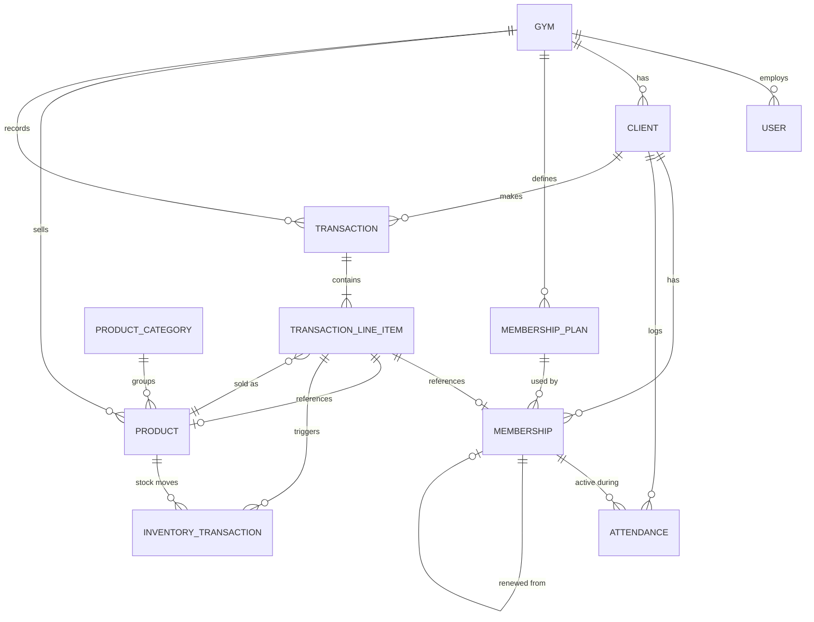

# Domain Model — Gym Management System

This model is designed for MVP (single gym) while keeping a clean migration path to multi-tenant SaaS. The single biggest design decision driving this model: **`gym_id` appears on every table from day one**, even though MVP will only ever have one row in the `Gym` table. See reasoning at the end.

---

## Entity-Relationship Diagram (Mermaid)

---

## Entities

### `Gym` *(tenant root — future-proofing)*

| Field | Type | Notes |
|---|---|---|
| id | UUID/PK | |
| name | string | |
| address | string | |
| contact_info | string | phone/email |
| default_membership_fee | decimal | |
| default_walkin_fee | decimal | |
| expiration_warning_days | int | drives "expiring soon" dashboard flag |
| walkin_inactivity_threshold_days | int | default: 7; drives walk-in "Inactive" status |
| member_inactivity_warning_days | int | default: 14; drives the "At risk" MEMBER client signal — active MEMBER clients who haven't visited within this window are surfaced in the "At risk" filter chip, Dashboard panel, and At-risk Members Report (ADR-019) |
| walkin_conversion_prompt_visits | int | default: 5; walk-in clients who reach this cumulative visit count with no Membership record trigger the pre-fee conversion prompt during check-in |
| created_at / updated_at | timestamp | |

**Reasoning:** In MVP there is exactly one row in this table. It exists anyway because adding `gym_id` as a foreign key to every other table *now* costs nothing, while adding it after the fact (post-launch, with real data) means rewriting every query and risking cross-tenant data leakage during migration. This is the cheapest insurance in the entire schema.

---

### `User` *(Owner account, future: staff accounts)*

| Field | Type | Notes |
|---|---|---|
| id | UUID/PK | |
| gym_id | FK → Gym | |
| username | string | |
| password_hash | string | never store plaintext |
| role | enum | MVP: `OWNER` only. Future: `STAFF`, `MANAGER` |
| created_at | timestamp | |

---

### `Client`

| Field | Type | Notes |
|---|---|---|
| id | UUID/PK | |
| gym_id | FK → Gym | |
| full_name | string, required | |
| contact_number | string, nullable | |
| email | string, nullable | reserved for future notifications |
| notes | text, nullable | freeform owner notes |
| date_registered | date | |
| client_type | derived, not stored | `MEMBER` if client has ≥1 Membership record; `WALK_IN` if zero. Never changes back to WALK_IN after a membership is created. |
| status | derived, not stored | branches by client_type — see derivation logic below |
| created_at / updated_at / deleted_at | timestamp | soft delete only |

**Status derivation logic (ADR-017):**
- **`MEMBER` type clients** — derived from membership dates:
  - `ACTIVE`: has a membership where `start_date ≤ today ≤ end_date`
  - `EXPIRING_SOON`: active membership with `end_date` within `Gym.expiration_warning_days`
  - `EXPIRED`: most recent membership has `end_date < today` and no current active membership
- **`WALK_IN` type clients** — derived from attendance recency:
  - `ACTIVE`: `max(Attendance.date)` is within `Gym.walkin_inactivity_threshold_days` of today
  - `INACTIVE`: `max(Attendance.date)` exceeds the threshold, or client has no attendance records at all

**Reasoning:** A stored status flag requires a background sync job and *will* drift. Both `client_type` and `status` are computed at query time from Membership and Attendance records that already exist — zero additional storage, zero sync risk, guaranteed correctness. See ADR-002 and ADR-017.

**At-risk signal (derived, not stored — ADR-019):** A MEMBER client with an active membership (`end_date >= today`) and no Attendance record within `Gym.member_inactivity_warning_days` days is considered at-risk. This is a query-time operational signal, NOT a `Client.status` value — an at-risk member's status remains Active or Expiring Soon as determined by their membership dates. At-risk is surfaced in the "At risk" Client List filter chip, the Dashboard "At-risk members" panel, and the At-risk Members Report (US-8.14). A client with an active membership and zero attendance records at all is treated as at-risk immediately.

---

### `MembershipPlan` *(catalog of durations/prices)*

| Field | Type | Notes |
|---|---|---|
| id | UUID/PK | |
| gym_id | FK → Gym | |
| name | string | e.g. "1 Month", "Custom 45-Day" |
| duration_days | int | |
| default_price | decimal | |
| is_active | bool | allows retiring old plans without deleting history |
| created_at | timestamp | |

**Reasoning:** Separating the *plan catalog* from the *individual membership instance* lets the owner manage default offerings (1/2/3 month + custom) without that catalog being entangled with what any specific client actually paid.

**Management UI:** Plan creation, editing, and retirement are handled in Settings → Membership Plans. The Add/Renew membership modal populates its plan selector from `MembershipPlan` where `is_active = true`. See ADR-015.

---

### `Membership` *(an individual client's purchased period)*

| Field | Type | Notes |
|---|---|---|
| id | UUID/PK | |
| client_id | FK → Client | |
| membership_plan_id | FK → MembershipPlan, nullable | nullable to allow a fully custom one-off membership not tied to a catalog plan |
| start_date | date | |
| end_date | date | |
| price_paid | decimal | **snapshot**, independent of plan's current default_price |
| renewed_from_membership_id | FK → Membership, nullable, self-referencing | links renewal chains without overwriting history |
| created_at | timestamp | |

**Status is derived, not stored:** `ACTIVE` if `end_date >= today`, else `EXPIRED`. Same reasoning as Client.status above — avoids drift.

**Business rule enforced at the application layer:** a client may have at most one membership with `end_date >= today` at any given time (no overlapping active memberships).

---

### `Attendance`

| Field | Type | Notes |
|---|---|---|
| id | UUID/PK | |
| gym_id | FK → Gym | |
| client_id | FK → Client | |
| visit_date | date | |
| time_in | time | |
| time_out | time, nullable | **not used in MVP fee logic**, but captured as a free nullable field now so future occupancy/duration analytics don't require a schema migration |
| visit_type | enum | `MEMBER` / `WALK_IN` |
| membership_id | FK → Membership, nullable | **snapshot link** — records which membership (if any) was active at time of visit, so later expiry/renewal never rewrites historical attendance meaning |
| fee_charged | decimal, nullable | populated for WALK_IN visits |
| created_by | FK → User, required | records which user logged the check-in; forward-compatible with staff accounts (US-1.5, P2) without migration; follows `Transaction.created_by` pattern (ADR-021) |
| correction_note | text, nullable | populated when `time_in` is edited post-creation (Flow 15); stores the owner's reason for the correction; null on all unedited records |
| created_at | timestamp | |

**Reasoning for `membership_id` snapshot link:** Without it, a report asking "was this person a paying member on March 3rd" would require reconstructing membership date ranges retroactively — fragile and slow. Storing the link at the moment of check-in makes this a simple, permanently-correct lookup.

**Conversion derivation (ADR-020):** Walk-in-to-member conversion is detected at query time: MEMBER-type clients who have ≥ 1 Attendance record with `visit_type = WALK_IN` where `visit_date` predates their earliest `Membership.created_at`. No conversion event entity or stored conversion date exists — the derivation uses existing Attendance and Membership records and must be applied consistently across all surfaces that display conversion data (US-8.8, US-2.10, Dashboard "Frequent walk-ins" panel).

---

### `ProductCategory`

| Field | Type | Notes |
|---|---|---|
| id | UUID/PK | |
| gym_id | FK → Gym | |
| name | string | e.g. "Beverage", "Supplement" |

---

### `Product`

| Field | Type | Notes |
|---|---|---|
| id | UUID/PK | |
| gym_id | FK → Gym | |
| category_id | FK → ProductCategory | |
| name | string | |
| product_type | enum | `STANDARD_PRODUCT` (sold per unit, e.g. bottled water) or `SERVING_BASED_PRODUCT` (sold per scoop/serving, e.g. protein powder) |
| selling_price | decimal | price per unit or per serving — **never read directly into a past transaction** |
| cost_price | decimal, nullable | purchase cost per unit or serving — stored at MVP to enable future margin reporting without a schema migration |
| image_url | string, nullable | product photo displayed in the POS grid |
| current_stock | decimal | unit count for STANDARD_PRODUCT; remaining serving count for SERVING_BASED_PRODUCT |
| servings_per_container | int, nullable | SERVING_BASED_PRODUCT only — e.g., 70 for a standard protein tub |
| low_stock_threshold | decimal | drives dashboard low-stock alert |
| is_active | bool | soft "discontinue" flag — archived products are hidden from POS but history is preserved |
| created_at / updated_at | timestamp | |

---

### `InventoryTransaction` *(stock movement ledger)*

| Field | Type | Notes |
|---|---|---|
| id | UUID/PK | |
| product_id | FK → Product | |
| type | enum | `PURCHASE`, `SALE`, `ADJUSTMENT` |
| quantity_delta | decimal | positive for purchase/adjustment-up, negative for sale/adjustment-down |
| resulting_stock | decimal | snapshot of stock level immediately after this movement — enables point-in-time auditing without recomputation |
| reference_transaction_line_item_id | FK → TransactionLineItem, nullable | links a SALE movement back to the sale that caused it |
| note | string, nullable | required for ADJUSTMENT type (why was stock manually changed?) |
| created_at | timestamp | |

**Reasoning:** A single `current_stock` counter on `Product` cannot be audited. If the count is ever wrong, there's no way to find out why. This ledger is the system of record; `Product.current_stock` becomes a cached/derived value recomputable from the ledger if it ever drifts.

---

### `Transaction` *(unified revenue ledger — covers both client payments and POS sales)*

| Field | Type | Notes |
|---|---|---|
| id | UUID/PK | |
| gym_id | FK → Gym | |
| transaction_type | enum | `CLIENT_TRANSACTION` (membership/walk-in fees — client required) or `POS_SALE` (product sales — no client required) |
| client_id | FK → Client, nullable | required when `transaction_type = CLIENT_TRANSACTION`; null for `POS_SALE` transactions |
| transaction_date | datetime | |
| total_amount | decimal | sum of line items, computed/stored for fast reporting |
| payment_method | enum | `CASH`, `GCASH`, `CARD`, `OTHER` |
| status | enum | `COMPLETED`, `VOID` |
| void_reason | string, nullable | required if status = VOID |
| created_by | FK → User | |
| created_at | timestamp | |

**Reasoning — why one Transaction table:** A single `Transaction` table provides one unified revenue ledger for all money flowing through the gym. `CLIENT_TRANSACTION` records always carry a `client_id` and contain only `MEMBERSHIP` or `WALK_IN_FEE` line items. `POS_SALE` records have no client and contain only `PRODUCT` line items. The `transaction_type` enum makes the distinction explicit at the data level while keeping revenue reporting simple — all income is queryable from one table regardless of whether it came from a membership fee or a protein shake sale. See ADR-006 and ADR-012.

---

### `TransactionLineItem`

| Field | Type | Notes |
|---|---|---|
| id | UUID/PK | |
| transaction_id | FK → Transaction | |
| item_type | enum | `MEMBERSHIP`, `WALK_IN_FEE`, `PRODUCT` |
| reference_membership_id | FK → Membership, nullable | populated when item_type = MEMBERSHIP |
| reference_product_id | FK → Product, nullable | populated when item_type = PRODUCT |
| description | string | human-readable snapshot (e.g. "1 Month Membership", "Whey Protein - 1 scoop") |
| quantity | decimal | |
| unit_price | decimal | **price snapshot at time of sale** |
| subtotal | decimal | quantity × unit_price |

**Constraint:** A `TransactionLineItem`'s `item_type` must match its parent `Transaction`'s `transaction_type`: `CLIENT_TRANSACTION` records may only contain `MEMBERSHIP` and `WALK_IN_FEE` items; `POS_SALE` records may only contain `PRODUCT` items. Mixing types across `transaction_type` boundaries is not permitted.

**Reasoning:** `unit_price` is always copied at the moment of sale, never joined live from `Product.selling_price` or `MembershipPlan.default_price`. This is the single most important correctness rule in the whole schema — without it, a price change next month silently rewrites the financial meaning of every past sale.

---

## Cross-Cutting Design Decisions

1. **Soft deletes everywhere financial/historical data is involved** (`Client`, `Product`). Hard deletes are reserved for things with zero downstream references (e.g., an unused draft).
2. **`gym_id` on every table** — see Gym entity reasoning above. This is the cheapest tenant-readiness investment available.
3. **Derived status fields, not stored flags**, for anything computable from dates (Client status, Membership status). Avoids sync jobs and drift bugs.
4. **Snapshots over live references** for anything involving money (price_paid, unit_price) — past transactions must never change meaning when current catalog data changes.
5. **Ledgers over counters** for anything involving quantity (inventory) — a single mutable number can't be audited; an append-only movement log can.

---

## What's Deliberately *Not* in This Model (Future)

- `Branch` entity (multi-location) — would sit between `Gym` and everything else; not needed until multi-branch is in scope.
- `Role`/`Permission` join tables for granular RBAC — MVP only needs a single `role` enum value.
- `Discount`/`Promotion` entity — manual price override on line items already covers MVP needs.
- `SupplierCost` field on `Product` — needed for margin reporting, deferred until profit (not just revenue) reporting is prioritized.
